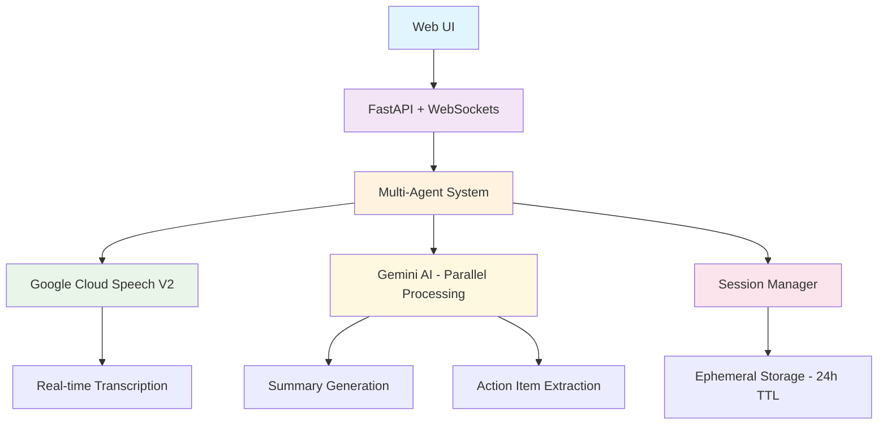

# 🎤 Econome - Real-Time Conversation Intelligence System

[](https://cloud.google.com)
[](https://fastapi.tiangolo.com)
[](https://python.org)
[](#privacy-features)

> **Privacy-first conversation intelligence system** that automatically analyzes conversations and extracts actionable insights using Google Cloud Speech V2 and Gemini AI.

## 🚀 Quick Start

### One-Command Deployment
```bash
# 1. Setup your credentials (see setup guide)
./setup-credentials.sh

# 2. Deploy to Google Cloud
./deploy.sh
```

### Local Development
```bash
# Setup local environment
./setup-local.sh

# Start development server
source adk-env/bin/activate
python web_api.py
```

**🌐 Access your app:** `http://localhost:8080`

---

## 🏗️ Architecture Overview



### 🔧 Technology Stack

| Component | Technology | Purpose |
|-----------|------------|---------|
| **Frontend** | HTML5 + JavaScript + Tailwind CSS | Responsive web interface |
| **Backend** | FastAPI + WebSockets | Real-time API & communication |
| **Speech Processing** | Google Cloud Speech V2 | Real-time transcription |
| **AI Analysis** | Gemini 1.5 Pro | Parallel summary + action extraction |
| **Storage** | Google Firestore with TTL | Ephemeral session data |
| **Deployment** | Google Cloud Run | Serverless container hosting |
| **CI/CD** | Google Cloud Build | Automated deployment |

---

## ✨ Key Features

### 🎯 **Core Capabilities**
- **🎤 Real-time Recording** - Live audio capture with WebSocket streaming
- **📝 Live Transcription** - Google Cloud Speech V2 with 2-second chunks
- **🧠 Parallel AI Processing** - Simultaneous summary + action item extraction
- **📋 Smart Action Items** - Categorized todos, communications, and reminders
- **🔗 Ephemeral URLs** - Secure 24-hour access links
- **📱 Responsive Design** - Works on desktop, tablet, and mobile

### 🔒 **Privacy Features**
- **Privacy-first Design** - No permanent conversation storage
- **Automatic Data Deletion** - All data deleted after 24 hours
- **Secure Access** - Cryptographically secure session tokens
- **Memory-only Processing** - Conversations processed in memory
- **Verifiable Deletion** - Users can confirm data destruction

### ⚡ **Performance**
- **Multi-agent Architecture** - Coordinated parallel processing
- **Real-time WebSockets** - Live transcription streaming
- **Optimized Chunks** - 2-second audio segments for quality
- **Cloud-native** - Serverless scaling on Google Cloud Run

---

## 📁 Project Structure

```
econome/
├── 🎯 Core Application
│   ├── main.py                 # Interactive demo & testing
│   ├── web_api.py             # FastAPI web server
│   ├── meeting_agents.py      # Multi-agent conversation system
│   ├── speech_agent.py        # Google Cloud Speech V2 integration
│   ├── gemini_agent.py        # Gemini AI processing
│   ├── websocket_manager.py   # Real-time communication
│   └── gcp_session_manager.py # Ephemeral session storage
│
├── 🌐 Frontend
│   └── frontend/
│       └── index.html         # Web interface
│
├── 🚀 Deployment
│   ├── Dockerfile            # Container configuration
│   ├── cloudbuild.yaml       # Google Cloud Build
│   ├── deploy.sh             # Automated deployment script
│   ├── setup-local.sh        # Local development setup
│   └── setup-credentials.sh  # Credential configuration
│
├── 📚 Documentation
│   ├── README.md             # This file
│   ├── DEPLOYMENT_GUIDE.md   # Detailed deployment instructions
│   └── README_WEB_UI.md      # Web interface documentation
│
└── ⚙️ Configuration
    ├── requirements.txt       # Python dependencies
    ├── .gitignore            # Security & exclusions
    └── .env.example          # Environment template
```

---

## 🎮 Usage Examples

### 1. **Business Meeting Analysis**
```
🎤 "We need to finalize the Q4 budget by Friday. 
    Sarah will send the revised numbers, and I'll 
    schedule a follow-up with the finance team."

📊 Results:
📝 Summary: Discussion about Q4 budget finalization
📋 Action Items:
   • Finalize Q4 budget (Due: Friday)
   • Sarah to send revised numbers
   • Schedule follow-up with finance team
```

### 2. **Project Planning Session**
```
🎤 "Let's launch the new feature next month. 
    I need to call the development team tomorrow 
    and email the stakeholders about the timeline."

📊 Results:
📝 Summary: New feature launch planning for next month
📋 Action Items:
   • Call development team (Due: Tomorrow)
   • Email stakeholders about timeline
   • Launch new feature (Due: Next month)
```

---

## 🛠️ Setup & Deployment

### Prerequisites
- Google Cloud account with billing enabled
- Google Cloud CLI installed
- Docker installed
- Python 3.11+

### Detailed Setup
📖 **[Complete Deployment Guide](DEPLOYMENT_GUIDE.md)** - Step-by-step instructions

📱 **[Web UI Documentation](README_WEB_UI.md)** - Frontend setup & features

---

## 🔐 Security & Secrets Management

### **Google Secret Manager Integration**
All production secrets are managed through Google Secret Manager:

```bash
# Secrets are automatically created during deployment
gcloud secrets create speech-credentials --data-file=speech-credentials.json
gcloud secrets create gemini-credentials --data-file=gemini-credentials.json
```

### **Environment Variables**
```bash
# Production (Cloud Run)
GOOGLE_CLOUD_PROJECT=your-project-id
PORT=8080

# Development (Local)
GOOGLE_APPLICATION_CREDENTIALS=./speech-credentials.json
SPEECH_CREDENTIALS_PATH=./speech-credentials.json
GEMINI_CREDENTIALS_PATH=./gemini-credentials.json
```

### **Protected Files** (Never commit these)
- `speech-credentials.json` - Google Cloud Speech service account
- `gemini-credentials.json` - Gemini AI service account  
- `.env` - Local environment variables
- Any `*-credentials.json` files

---

## 🚀 GitHub & CI/CD Setup

### **Repository Setup**
```bash
# Initialize repository
git init
git add .
git commit -m "Initial commit: Real-Time Conversation Intelligence System"

# Create GitHub repository
gh repo create econome --public --description "Privacy-first conversation intelligence system"
git remote add origin https://github.com/YOUR_USERNAME/econome.git
git push -u origin main
```

### **GitHub Actions CI/CD**
The project includes automated deployment via Google Cloud Build:

1. **Trigger**: Push to `main` branch
2. **Build**: Docker container with dependencies
3. **Deploy**: Automatic deployment to Cloud Run
4. **Secrets**: Managed via Google Secret Manager

---

## 💰 Cost Estimation

**Typical monthly costs for moderate usage:**
- **Cloud Run**: $0-5 (pay per request, 2M free requests/month)
- **Speech-to-Text**: $5-20 (60 minutes free/month)
- **Gemini AI**: $10-30 (varies by usage)
- **Storage**: $0 (ephemeral, auto-deleted)
- **Total**: ~$15-55/month for regular use

**Free tier includes:**
- 2 million Cloud Run requests
- 60 minutes Speech-to-Text
- Generous Gemini AI quotas

---

## 🧪 Testing

```bash
# Run comprehensive system test
python main.py --test

# Test individual components
python test_web_system.py
python test_gemini.py
python test_stt_simple.py

# Start interactive demo
python main.py
```

---

## 🏆 Hackathon Features

### **Technical Excellence**
✅ Multi-agent architecture with real-time coordination  
✅ Parallel Gemini processing for performance  
✅ WebSocket real-time communication  
✅ Cloud-native deployment on Google Cloud Run  

### **Privacy Innovation**
✅ Ephemeral storage with automatic deletion  
✅ Firestore TTL for guaranteed data destruction  
✅ Memory-only processing pipeline  
✅ Verifiable deletion for user trust  

### **User Experience**
✅ Intuitive web interface with real-time feedback  
✅ Professional results display  
✅ Secure access links for practical use  
✅ Responsive design for any device  

---

## 📞 Support & Contributing

- **Issues**: [GitHub Issues](https://github.com/YOUR_USERNAME/econome/issues)
- **Documentation**: See `docs/` folder
- **Deployment Help**: Check [DEPLOYMENT_GUIDE.md](DEPLOYMENT_GUIDE.md)

---

## 📄 License

MIT License - see [LICENSE](LICENSE) file for details.

---

**🎉 Ready to deploy?** Run `./deploy.sh` and follow the prompts!
