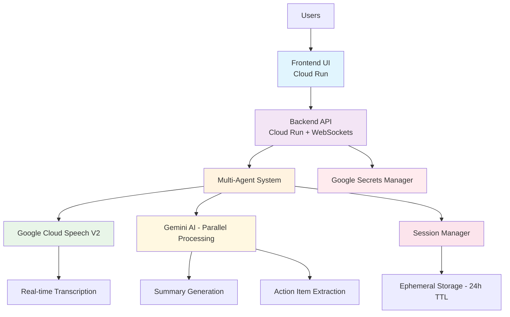

# 🎤 Econome - Real-Time Conversation Intelligence System

[](https://cloud.google.com)
[](https://fastapi.tiangolo.com)
[](https://python.org)
[](#privacy-features)

> **Privacy-first conversation intelligence system** that automatically analyzes conversations and extracts actionable insights using Google Cloud Speech V2 and Gemini AI.

## 🚀 Quick Start

### One-Command Deployment
```bash
# 1. Setup your credentials (see setup guide)
./scripts/setup-credentials.sh

# 2. Deploy to Google Cloud
./scripts/deploy.sh
```

### Local Development
```bash
# Clone and setup
git clone https://github.com/avni-salhotra/econome.git
cd econome
pip install -r requirements.txt

# Configure environment
export GOOGLE_CLOUD_PROJECT="your-project-id"
export MOCK_MODE=true

# Start development server
cd src
python main.py
```

**🌐 Access your app:** `http://localhost:8080`

---

## 🏗️ Architecture Overview

### **System Architecture**


### **Enhanced CI/CD Pipeline**
```mermaid
graph LR
    A[Code Push / PR] --> B[01-Test & Validate]
    B --> C[02-Build & Push]
    C --> D[03-Deploy Staging]
    D --> E[04-Deploy Production]
    D --> F[05-Auto Prod (opt)]
    C --> G[99-Manual Ops]

    B --> B1[Unit + Integration + Security tests]
    C --> C1[Docker build] --> C2[Push to Artifact Registry]
    D --> D1[Deploy to Cloud Run] --> D2[Smoke + E2E tests]
```

### 🔧 Technology Stack

| Component | Technology | Purpose |
|-----------|------------|---------|
| **Frontend** | HTML5 + Vanilla JS (MediaRecorder) + Tailwind CSS | Record & stream audio, display live transcripts via Server-Sent Events (SSE) |
| **Backend** | FastAPI + HTTP + SSE | Real-time API & event push – no WebSockets required |
| **Speech Processing** | Google Cloud Speech-to-Text V2 (latest_long) | Streaming transcription (≤100 ms chunks) |
| **AI Analysis** | Gemini 1.5 Pro | Parallel summarisation & action-item extraction |
| **Storage** | Firestore + TTL (24 h) | Ephemeral session metadata |
| **Container Runtime** | Cloud Run (us-central1) | Serverless autoscale, 1-10 instances |
| **CI/CD** | GitHub Actions (01-05 workflows) | Build, push, deploy, and manual ops |

---

## ✨ Key Features

### 🎯 **Core Capabilities**
- **🎤 Real-time Recording** - Live audio capture with HTTP chunked streaming
- **📝 Live Transcription** - Google Cloud Speech V2 with 2-second chunks
- **🧠 Parallel AI Processing** - Simultaneous summary + action item extraction
- **📋 Smart Action Items** - Categorized todos, communications, and reminders
- **🔗 Ephemeral URLs** - Secure 24-hour access links
- **📱 Responsive Design** - Works on desktop, tablet, and mobile

### 🔒 **Privacy Features**
- **Privacy-first Design** - No permanent conversation storage
- **Automatic Data Deletion** - All data deleted after 24 hours
- **Secure Access** - Cryptographically secure session tokens
- **Memory-only Processing** - Conversations processed in memory
- **Verifiable Deletion** - Users can confirm data destruction

### ⚡ **Performance**
- **Multi-agent Architecture** - Coordinated parallel processing
- **Real-time HTTP/SSE** - Live transcription streaming
- **Optimized Chunks** - 2-second audio segments for quality
- **Cloud-native** - Serverless scaling on Google Cloud Run

---

## 📁 Project Structure

```
econome/
├── 🎯 Core Application
│   ├── run.py                 # Main entry point
│   ├── web_api.py             # Web API entry point
│   └── src/                   # Source code package
│       ├── __init__.py        # Package initialization
│       ├── main.py            # Interactive demo & testing
│       ├── web_api.py         # FastAPI web server
│       ├── meeting_agents.py  # Multi-agent conversation system
│       ├── speech_agent.py    # Google Cloud Speech V2 integration
│       ├── gemini_agent.py    # Gemini AI processing
│       ├── websocket_manager.py # Real-time communication
│       └── gcp_session_manager.py # Ephemeral session storage
│
├── 🧪 Testing
│   ├── tests/                 # Test suite
│   │   ├── __init__.py        # Test package initialization
│   │   └── test_e2e_system.py # End-to-end system tests (HTTP API)
│
├── 🌐 Frontend
│   └── frontend/
│       └── index.html         # Web interface
│
├── 🚀 Deployment & DevOps
│   ├── devops/                  # Container & legacy Cloud Build configs (kept for reference)
│   │   └── Dockerfile[.ui]      # Build context
│   ├── .github/workflows/       # —— Primary CI/CD ——
│   │   ├── 01-test-and-validate.yml
│   │   ├── 02-build-and-push.yml
│   │   ├── 03-deploy-staging.yml
│   │   ├── 04-deploy-production.yml
│   │   ├── 05-auto-production-deploy.yml (opt)
│   │   └── 99-manual-operations.yml
│   ├── scripts/               # Setup and utility scripts
│   │   ├── deploy.sh          # Automated deployment script
│   │   ├── setup-local.sh     # Local development setup
│   │   ├── setup-credentials.sh # Credential configuration
│   │   └── setup.sh           # General setup script
│   └── .github/workflows/     # CI/CD automation
│       ├── deploy.yml         # CI pipeline (automated)
│       └── deploy-manual.yml  # CD pipeline (manual)
│
├── 📚 Documentation
│   ├── README.md              # This file
│   └── docs/                  # Documentation folder
│       ├── DEPLOYMENT_GUIDE.md # Detailed deployment instructions
│       ├── README_WEB_UI.md   # Web interface documentation
│       └── SECRETS_MANAGEMENT.md # Security & secrets guide
│
└── ⚙️ Configuration
    ├── requirements.txt       # Python dependencies
    ├── .gitignore            # Security & exclusions
    ├── .env.example          # Environment template
    └── service.yaml          # App Engine configuration (legacy)
```

---

## 🎮 Usage Examples

### 1. **Business Meeting Analysis**
```
🎤 "We need to finalize the Q4 budget by Friday. 
    Sarah will send the revised numbers, and I'll 
    schedule a follow-up with the finance team."

📊 Results:
📝 Summary: Discussion about Q4 budget finalization
📋 Action Items:
   • Finalize Q4 budget (Due: Friday)
   • Sarah to send revised numbers
   • Schedule follow-up with finance team
```

### 2. **Project Planning Session**
```
🎤 "Let's launch the new feature next month. 
    I need to call the development team tomorrow 
    and email the stakeholders about the timeline."

📊 Results:
📝 Summary: New feature launch planning for next month
📋 Action Items:
   • Call development team (Due: Tomorrow)
   • Email stakeholders about timeline
   • Launch new feature (Due: Next month)
```

---

## 🛠️ Setup & Deployment

### Prerequisites
- Google Cloud account with billing enabled
- Google Cloud CLI installed
- Docker installed
- Python 3.11+

### Detailed Setup
📖 **[Complete Deployment Guide](docs/DEPLOYMENT_GUIDE.md)** - Step-by-step instructions

📱 **[Web UI Documentation](docs/README_WEB_UI.md)** - Frontend setup & features

🔐 **[Secrets Management Guide](docs/SECRETS_MANAGEMENT.md)** - Security best practices

---

## 🔐 Security & Secrets Management

### **Google Secret Manager Integration**
All production secrets are managed through Google Secret Manager:

```bash
# Secrets are automatically created during deployment
gcloud secrets create speech-credentials --data-file=speech-credentials.json
gcloud secrets create gemini-credentials --data-file=gemini-credentials.json
```

### **Environment Variables**
```bash
# Production (Cloud Run)
GOOGLE_CLOUD_PROJECT=your-project-id
PORT=8080

# Development (Local)
GOOGLE_APPLICATION_CREDENTIALS=./speech-credentials.json
SPEECH_CREDENTIALS_PATH=./speech-credentials.json
GEMINI_CREDENTIALS_PATH=./gemini-credentials.json
```

### **Protected Files** (Never commit these)
- `speech-credentials.json` - Google Cloud Speech service account
- `gemini-credentials.json` - Gemini AI service account  
- `.env` - Local environment variables
- Any `*-credentials.json` files

---

## 🚀 GitHub & CI/CD Setup

### **Repository Setup**
```bash
# Initialize repository
git init
git add .
git commit -m "Initial commit: Real-Time Conversation Intelligence System"

# Create GitHub repository
gh repo create econome --public --description "Privacy-first conversation intelligence system"
git remote add origin https://github.com/YOUR_USERNAME/econome.git
git push -u origin main
```

### **GitHub Actions CI/CD**
The pipeline is split into small, composable workflows:

| ID | Workflow | Trigger |
|----|-----------|---------|
| 01 | Test & Validate | `pull_request`, `push` to feature/fix branches |
| 02 | Build & Push | `push` to `main`, or success of 01 |
| 03 | Deploy Staging | Called by 02 after image push |
| 04 | Deploy Production | Manual (`workflow_dispatch`) |
| 05 | Auto Production Deploy (optional) | Success of 03 (disabled by default) |
| 99 | Manual Operations | On-demand ops: rollback, scale, logs |

Legacy Cloud Build YAMLs are retained under `devops/cloudbuild/` for historical reference but **are no longer used**.

### **Continuous Deployment commands**
```bash
# Trigger staging deploy manually (rarely needed)
gh workflow run "03-deploy-staging.yml" -f image-tag=<build-number> -f build-id=<run_id>

# Trigger production deploy
gh workflow run "04-deploy-production.yml" -f image-tag=<build-number> -f confirm-production=DEPLOY
```

---

## 💰 Cost Estimation

**Typical monthly costs for moderate usage:**
- **Cloud Run**: $0-5 (pay per request, 2M free requests/month)
- **Speech-to-Text**: $5-20 (60 minutes free/month)
- **Gemini AI**: $10-30 (varies by usage)
- **Storage**: $0 (ephemeral, auto-deleted)
- **Total**: ~$15-55/month for regular use

**Free tier includes:**
- 2 million Cloud Run requests
- 60 minutes Speech-to-Text
- Generous Gemini AI quotas

---

## 🧪 Testing

```bash
# Run comprehensive system test
python run.py --test

# Test individual components
python -m pytest tests/

# Test web system integration
python -m pytest tests/ -v

# Start interactive demo
python run.py
```

---

## 🏆 Hackathon Features

### **Technical Excellence**
✅ Multi-agent architecture with real-time coordination  
✅ Parallel Gemini processing for performance  
✅ WebSocket real-time communication  
✅ Cloud-native deployment on Google Cloud Run  

### **Privacy Innovation**
✅ Ephemeral storage with automatic deletion  
✅ Firestore TTL for guaranteed data destruction  
✅ Memory-only processing pipeline  
✅ Verifiable deletion for user trust  

### **User Experience**
✅ Intuitive web interface with real-time feedback  
✅ Professional results display  
✅ Secure access links for practical use  
✅ Responsive design for any device  

---

## 📞 Support & Contributing

- **Issues**: [GitHub Issues](https://github.com/YOUR_USERNAME/econome/issues)
- **Documentation**: See `docs/` folder
- **Deployment Help**: Check [DEPLOYMENT_GUIDE.md](docs/DEPLOYMENT_GUIDE.md)

---

## 📄 License

MIT License - see [LICENSE](LICENSE) file for details.

---

**🎉 Ready to deploy?** Run `./scripts/deploy.sh` and follow the prompts!

> **NOTE:** WebSocket support was removed in favour of HTTP + SSE which works reliably behind Cloud Run's HTTP/2 proxy.
