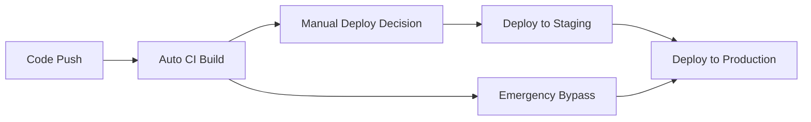

# DevOps Configuration

This directory contains all the deployment and infrastructure configuration for the Econome Real-Time Conversation Intelligence System.

## 🏗️ CI/CD Architecture & Best Practices

This setup follows **Site Reliability Engineering (SRE)** industry best practices for cloud-native applications, implementing a **separation of concerns** approach where build and deployment are independent operations.

## Directory Structure

```
devops/
├── cloudbuild-ci.yaml      # CI pipeline (build and push only)
├── cloudbuild-prod.yaml    # Production deployment pipeline
├── cloudbuild-deploy.yaml  # Deployment using deploy script
├── deploy.sh               # Smart deployment script (local + Cloud Build)
├── Dockerfile              # Container configuration
└── secrets/                # Credential files (gitignored)
    ├── speech-credentials.json
    └── gemini-credentials.json
```

## Files Overview

## 🎯 Design Principles

### **1. Build Once, Deploy Many**
Following the **immutable infrastructure** principle, we build container images once and deploy the same artifact across all environments. This ensures consistency and reduces deployment risk.

### **2. Separation of Concerns**
- **CI (Continuous Integration)**: Automated building and testing
- **CD (Continuous Deployment)**: Controlled, manual deployment decisions
- **Emergency**: Bypass for critical hotfixes

### **3. Environment Promotion**
Images flow through environments (dev → staging → production) without rebuilding, ensuring what you test is what you deploy.

## 📋 Cloud Build Configurations

### **Tier 1: Continuous Integration**
- **`cloudbuild-ci.yaml`**: Automated CI pipeline
  - **Trigger**: Every push to main branch
  - **Purpose**: Build, test, and push Docker images
  - **Output**: Immutable container image in registry
  - **SRE Rationale**: Fast feedback loop, early detection of issues

### **Tier 2: Controlled Deployment** ⭐ (Primary)
- **`cloudbuild-deploy.yaml`**: Deployment-only pipeline
  - **Trigger**: Manual with environment parameters
  - **Purpose**: Deploy existing images to specified environments
  - **Benefits**: Fast deployment, easy rollbacks, environment promotion
  - **SRE Rationale**: Separation of build/deploy concerns, reduced deployment time

### **Tier 3: Emergency Bypass**
- **`cloudbuild-prod.yaml`**: Complete build+deploy pipeline
  - **Trigger**: Manual emergency use only
  - **Purpose**: Bypass CI when immediate deployment needed
  - **Use Case**: Critical hotfixes when CI pipeline is broken
  - **SRE Rationale**: Business continuity during CI outages

### Deployment

- **`deploy.sh`**: Smart deployment script with environment detection that handles:
  - **Local Environment**: Interactive setup with user prompts
  - **Cloud Build Environment**: Automated deployment using environment variables
  - Prerequisites checking (local only)
  - Google Cloud project setup
  - API enablement (local only)
  - Secret management (local only)
  - IAM permissions
  - Service deployment

### Container

- **`Dockerfile`**: Multi-stage Docker configuration optimized for:
  - Security (non-root user)
  - Performance (layer caching)
  - Privacy (credential files removed from image)
  - Health monitoring

### Secrets

- **`secrets/`**: Directory for credential files (automatically gitignored)
  - `speech-credentials.json`: Google Cloud Speech-to-Text service account key
  - `gemini-credentials.json`: Gemini AI service account key

## 🚀 Recommended CI/CD Workflow

### **Production-Ready Process** (SRE Best Practice)



### **Step-by-Step Workflow**

#### **1. Continuous Integration (Automated)**
```bash
# Triggered automatically on push to main
git push origin main
# → Triggers: econome-ci → cloudbuild-ci.yaml
# → Result: New image in registry (gcr.io/PROJECT/econome:BUILD_ID)
```

#### **2. Staging Deployment (Manual)**
```bash
# Deploy latest image to staging
gcloud builds submit --config devops/cloudbuild-deploy.yaml \
  --substitutions _ENVIRONMENT=staging,_IMAGE_TAG=latest
```

#### **3. Production Deployment (Manual)**
```bash
# Deploy tested image to production
gcloud builds submit --config devops/cloudbuild-deploy.yaml \
  --substitutions _ENVIRONMENT=production,_IMAGE_TAG=BUILD_ID
```

#### **4. Rollback (If Needed)**
```bash
# Rollback to previous version
gcloud builds submit --config devops/cloudbuild-deploy.yaml \
  --substitutions _ENVIRONMENT=production,_IMAGE_TAG=PREVIOUS_BUILD_ID
```

#### **5. Emergency Bypass (Rare)**
```bash
# Complete build+deploy when CI is broken
gcloud builds submit --config devops/cloudbuild-prod.yaml .
```

## 📊 Deployment Options Comparison

| Method | Speed | Risk | Use Case | Frequency |
|--------|-------|------|----------|-----------|
| **CI Only** | Fast | Low | Testing builds | Every commit |
| **Deploy Only** | Fastest | Lowest | Production deployment | Daily/Weekly |
| **Emergency** | Slow | Higher | Critical hotfixes | Rare |

## 🎯 Local Development

### **Quick Local Deployment**

```bash
# Make deploy script executable
chmod +x devops/deploy.sh

# Run interactive deployment (detects local environment)
./devops/deploy.sh
```

### 📋 Prerequisites

1. Google Cloud CLI installed and authenticated
2. Docker installed (local development only)
3. Required GCP APIs enabled:
   - Cloud Build API
   - Cloud Run API
   - Speech-to-Text API
   - AI Platform API
   - Secret Manager API

## 🏗️ Recommended GCP Trigger Setup

Based on SRE best practices, configure these Cloud Build triggers:

```yaml
Triggers:
├── econome-ci          # Auto: Push to main → cloudbuild-ci.yaml
├── econome-deploy      # Manual: Deploy → cloudbuild-deploy.yaml
└── econome-emergency   # Manual: Emergency → cloudbuild-prod.yaml
```

### **Trigger Configuration**

1. **econome-ci** (Continuous Integration)
   - **Event**: Push to branch `main`
   - **Configuration**: `devops/cloudbuild-ci.yaml`
   - **Purpose**: Automated builds and testing

2. **econome-deploy** (Controlled Deployment)
   - **Event**: Manual trigger
   - **Configuration**: `devops/cloudbuild-deploy.yaml`
   - **Purpose**: Deploy existing images with environment control

3. **econome-emergency** (Emergency Bypass)
   - **Event**: Manual trigger only
   - **Configuration**: `devops/cloudbuild-prod.yaml`
   - **Purpose**: Emergency deployments when CI is unavailable

### 🔍 SRE Best Practices Implemented

### **1. Immutable Infrastructure**
- **Practice**: Container images are built once and never modified
- **Implementation**: Same image deployed across all environments
- **Benefit**: Eliminates "works on my machine" issues

### **2. GitOps Principles**
- **Practice**: Infrastructure and deployments defined as code
- **Implementation**: All configurations in version control
- **Benefit**: Auditable, reproducible deployments

### **3. Fail-Fast Feedback Loops**
- **Practice**: Quick detection of issues
- **Implementation**: Automated CI builds on every commit
- **Benefit**: Reduced time to identify and fix problems

### **4. Deployment Safety**
- **Practice**: Controlled, manual deployment decisions
- **Implementation**: Separate CI and CD triggers
- **Benefit**: Prevents accidental production deployments

### **5. Disaster Recovery**
- **Practice**: Quick rollback capabilities
- **Implementation**: Deploy any previous image version
- **Benefit**: Rapid recovery from production issues

## 🤖 Environment Detection

The `deploy.sh` script automatically detects whether it's running in:

### Local Environment
- **Detection**: No `BUILD_ID` or `PROJECT_ID` environment variables
- **Behavior**:
  - Interactive prompts for configuration
  - Full prerequisite checking
  - API enablement
  - Secret creation from local files
  - Complete deployment process

### Cloud Build Environment
- **Detection**: Both `BUILD_ID` and `PROJECT_ID` environment variables present
- **Behavior**:
  - Uses environment variables automatically
  - Skips interactive prompts
  - Skips prerequisite checking (assumes Cloud Build environment is ready)
  - Skips API enablement (assumes APIs are already enabled)
  - Skips secret creation (assumes secrets are pre-configured)
  - Focuses on IAM setup and deployment

## Security Notes

- All credential files in `secrets/` are automatically gitignored
- Credentials are mounted as secrets in Cloud Run, not baked into images
- Container runs as non-root user for security
- Automatic credential cleanup in Dockerfile

## Environment Variables

The following environment variables are automatically configured:

- `GOOGLE_CLOUD_PROJECT`: Your GCP project ID
- `PORT`: Application port (8080)
- `GOOGLE_APPLICATION_CREDENTIALS`: Path to mounted speech credentials

## Service Configuration

Cloud Run service is configured with:
- **Memory**: 2Gi
- **CPU**: 2 cores
- **Concurrency**: 100 requests
- **Timeout**: 3600 seconds (1 hour)
- **Max Instances**: 10
- **Region**: us-central1

## 📊 Monitoring & Observability

- **Health check endpoint**: `/health`
- **API documentation**: `/docs`
- **Cloud Logging**: Enabled for all build and runtime logs
- **Build History**: Available in Cloud Build console
- **Deployment Tracking**: Each deployment tagged with BUILD_ID

## 🎓 Why These Practices Matter

### **Business Impact**
- **Reduced Downtime**: Fast rollbacks minimize service interruption
- **Faster Time-to-Market**: Automated CI enables rapid iteration
- **Lower Risk**: Tested, immutable artifacts reduce deployment failures

### **Engineering Benefits**
- **Developer Productivity**: Clear separation of concerns
- **Operational Excellence**: Predictable, repeatable deployments
- **Incident Response**: Quick rollback and emergency deployment capabilities

### **Compliance & Governance**
- **Audit Trail**: All deployments tracked and logged
- **Change Control**: Manual approval gates for production
- **Security**: Immutable infrastructure reduces attack surface

## 📚 References

This setup implements industry-standard practices from:
- **Google SRE Book**: Deployment and release engineering principles
- **DORA Metrics**: High-performing teams deployment patterns
- **GitOps**: Infrastructure and deployment as code
- **Twelve-Factor App**: Build, release, run separation
