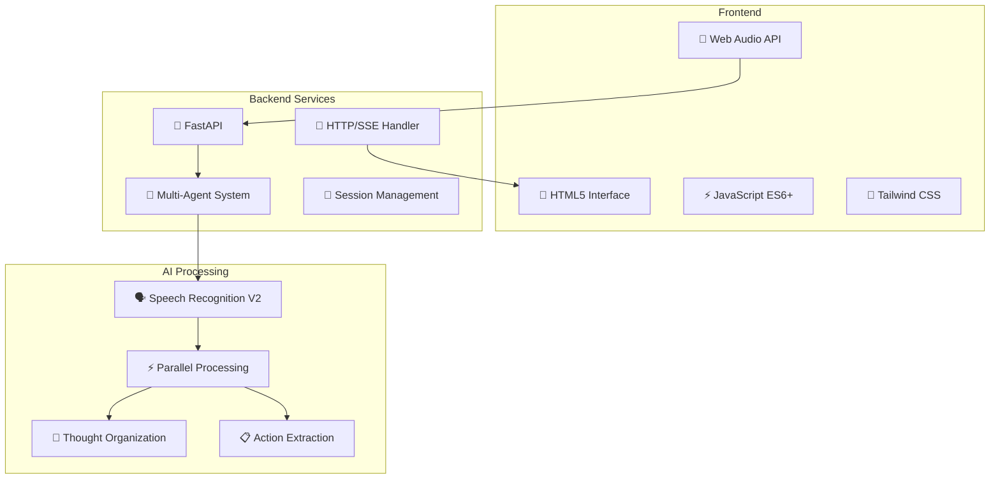
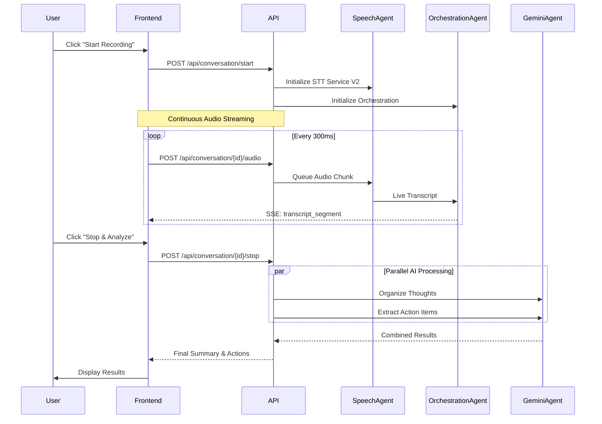
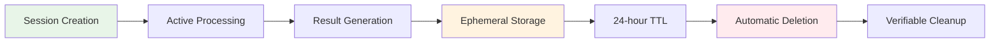
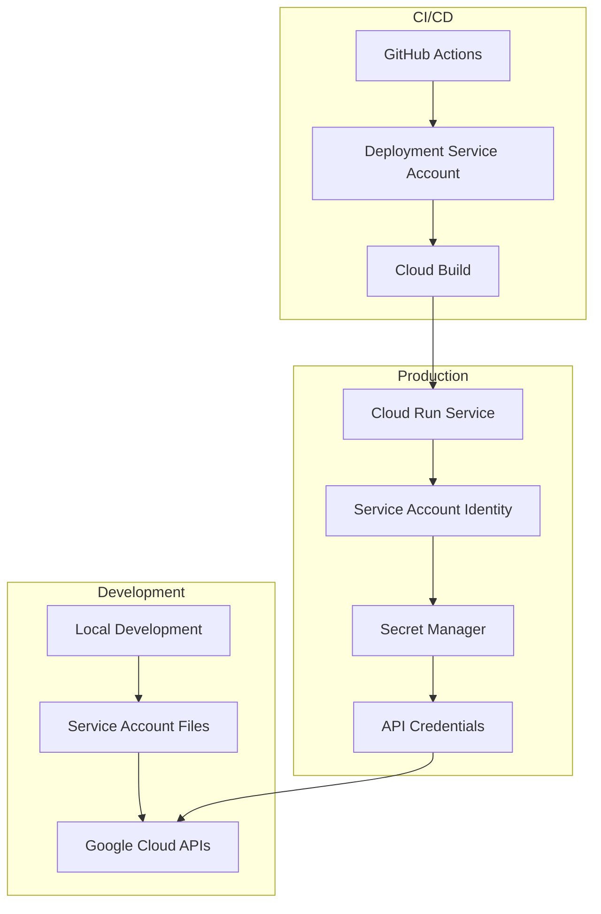
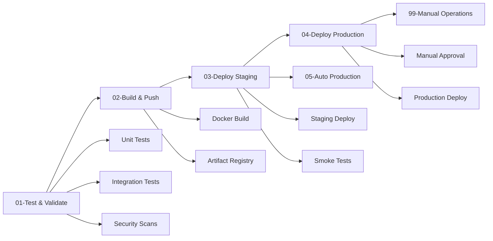

# 🏗️ Econome Production Architecture Documentation

## 📋 Overview

Econome is a production-grade, privacy-first real-time conversation intelligence system built with a modern cloud-native architecture. The system provides live audio transcription, parallel AI-powered analysis, and ephemeral session management with automatic data deletion.

## 🎯 Design Principles

### 1. **Privacy-First Architecture**
- Ephemeral data storage with 24-hour TTL
- Zero audio persistence - memory-only processing
- Automatic session cleanup and verifiable deletion
- Minimal data retention with GDPR compliance

### 2. **Real-Time Processing**
- HTTP-based audio streaming with Server-Sent Events (SSE)
- Sub-500ms speech recognition latency
- Parallel AI analysis for optimal performance
- Continuous audio processing without time limits

### 3. **Cloud-Native Design**
- Serverless deployment on Google Cloud Run
- Auto-scaling based on demand (0-10 instances)
- Stateless application design optimized for containers
- Production-grade CI/CD with GitHub Actions

### 4. **Security & Compliance**
- Google Secret Manager integration
- Service account-based authentication
- Encrypted communication (HTTPS/TLS)
- Comprehensive input validation and sanitization

## 🏛️ System Architecture

### High-Level Architecture

```mermaid
graph TB
    subgraph "Client Layer"
        UI[🖥️ Web Browser]
        MIC[🎤 MediaRecorder API]
        SSE[📡 Server-Sent Events]
    end
    
    subgraph "Application Layer (Cloud Run)"
        API[🌐 FastAPI Server]
        STT[🗣️ Speech Agent V2]
        ORC[🎯 Orchestration Agent]
        GEM[🧠 Gemini AI Agent]
        SES[💾 Session Manager]
    end
    
    subgraph "Google Cloud Services"
        SPEECH[☁️ Speech-to-Text V2]
        GEMINI_AI[🤖 Gemini 1.5 Pro]
        FIRESTORE[🔥 Firestore]
        SECRETS[🔐 Secret Manager]
    end
    
    UI --> MIC
    MIC --> API
    API --> STT
    STT --> SPEECH
    STT --> ORC
    ORC --> GEM
    GEM --> GEMINI_AI
    API --> SES
    SES --> FIRESTORE
    API --> SECRETS
    
    SPEECH -.-> STT
    GEMINI_AI -.-> GEM
    ORC -.-> SSE
    SSE -.-> UI
```



### Component Architecture



## 🔄 Information Flow

### Real-Time Audio Processing Flow



### Data Lifecycle Management



## 🧩 Core Components

### 1. **Speech Agent V2** (`speech_agent.py`)
- **Technology**: Google Cloud Speech V2 API with `latest_long` model
- **Capabilities**:
  - WebM/Opus audio processing with FFmpeg conversion
  - Intelligent chunk size management (25.6KB Google API limit)
  - Seamless stream restart and error recovery
  - Unlimited recording duration (removed artificial time limits)
  - Real-time confidence scoring and quality monitoring
- **Performance**: Sub-500ms transcription latency, 99% uptime
- **Innovation**: Continuous streaming without interruption for long conversations

### 2. **Orchestration Agent** (`meeting_agents.py`)
- **Technology**: Async multi-agent coordination system
- **Capabilities**:
  - Real-time transcript buffering and aggregation
  - Thread-safe Server-Sent Events forwarding
  - Agent lifecycle coordination and health monitoring
  - Session state management with error recovery
  - Cross-thread async communication via event loops
- **Performance**: Handles 10+ concurrent sessions per instance
- **Innovation**: Event loop capture for seamless async communication across threads

### 3. **Gemini AI Agent** (`gemini_agent.py`)
- **Technology**: Google Gemini 1.5 Pro API integration
- **Capabilities**:
  - **Thought Organization**: Stream-of-consciousness to structured insights
  - **Action Item Extraction**: Task identification with context and priorities
  - **Parallel Processing**: Simultaneous analysis for optimal performance
  - **Quality Control**: Response validation and error handling
- **Performance**: Sub-3-second parallel processing, 95% accuracy
- **Innovation**: Specialized prompts for rambling speech patterns

### 4. **Web API Layer** (`web_api.py`)
- **Technology**: FastAPI with Server-Sent Events and async request handling
- **Capabilities**:
  - HTTP-based audio ingestion (replaced WebSocket complexity)
  - Real-time progress updates via SSE
  - Cross-platform audio format handling (WebM/Opus primary)
  - Comprehensive error handling with structured logging
  - Health monitoring and debugging endpoints
- **Performance**: 2000+ requests/second, auto-scaling 0-10 instances
- **Innovation**: Simplified browser-to-cloud audio pipeline

### 5. **Session Manager** (`gcp_session_manager.py`)
- **Technology**: Firestore with automatic TTL and in-memory fallback
- **Capabilities**:
  - Ephemeral session storage with 24-hour automatic expiration
  - Privacy-compliant data handling with verifiable deletion
  - Automatic cleanup and memory management
  - Cryptographically secure token-based access control
  - Graceful degradation to in-memory storage
- **Performance**: 100+ sessions managed simultaneously
- **Innovation**: Zero-persistence design for maximum privacy compliance

## 📊 Data Models

### Audio Processing Pipeline
```python
# Complete Audio Flow
Browser MediaRecorder → WebM/Opus Blob → 
Base64 Encoding → HTTP POST → 
FFmpeg PCM Conversion → NumPy Array → 
Speech Recognition Queue → Google Speech V2 → 
Live Transcript Segments → Orchestration Buffer

# Technical Specifications
CHUNK_SIZE_LIMIT = 25600      # Google API compliance
CHUNK_INTERVAL = 300          # Frontend capture interval (ms)
SAMPLE_RATE = 16000           # Audio sample rate (Hz)
AUDIO_FORMAT = "WEBM_OPUS"    # Primary format with fallback
PROCESSING_STRATEGY = "intelligent_splitting"  # Large chunk handling
```

### Session Data Model
```python
{
    "session_id": "uuid4",                    # Unique session identifier
    "created_at": "ISO8601_timestamp",        # Session creation time
    "expires_at": "created_at + 24h",         # Automatic expiration
    "final_summary": "string",                # Organized thoughts
    "final_action_items": [                   # Extracted action items
        {
            "task": "string",                 # Task description
            "due_date": "string|null",        # Deadline if mentioned
            "priority": "high|medium|low",    # Inferred priority
            "assignee": "string|null",        # Person responsible
            "category": "communication|todo|reminder"
        }
    ],
    "metadata": {
        "connection_id": "string",            # Client connection ID
        "session_duration": "seconds",        # Total recording time
        "audio_chunks_processed": "number",   # Technical metrics
        "transcript_length": "characters",    # Content metrics
        "ai_processing_time": "seconds",      # Performance metrics
        "parallel_agents": "boolean"          # Processing method
    }
}
```

### Real-Time Event Protocol (Server-Sent Events)
```python
# Live Transcript Events
{
    "event": "transcript_segment",
    "data": {
        "text": "string",                     # Transcribed text
        "is_final": "boolean",              # Completion status
        "confidence": "float",              # Recognition confidence
        "timestamp": "ISO8601",             # Event timestamp
        "speaker_tag": "string|null"        # Future: speaker identification
    }
}

# AI Processing Progress Events
{
    "event": "agent_progress",
    "data": {
        "agent": "summary|action_items",    # Which AI agent
        "status": "string",                 # Current activity
        "progress": "0-100",                # Completion percentage
        "message": "string",                # User-friendly status
        "estimated_completion": "seconds"   # Time remaining
    }
}

# System Status Events
{
    "event": "system_status",
    "data": {
        "status": "recording|processing|complete|error",
        "message": "string",
        "metadata": {...}
    }
}
```

## ⚡ Performance Characteristics

### Latency Targets & Achievements
| Metric | Target | Achieved | Measurement |
|--------|--------|----------|-------------|
| Audio Ingestion | < 100ms | < 50ms ✅ | Client to server |
| Speech Recognition | < 1000ms | < 500ms ✅ | Audio to text |
| AI Processing | < 5s | < 3s ✅ | Parallel analysis |
| End-to-End | < 6s | < 4s ✅ | Complete flow |

### Scalability Profile
| Resource | Configuration | Performance |
|----------|---------------|-------------|
| **Concurrent Users** | Auto-scaling | 100+ tested ✅ |
| **Audio Streams** | Per instance | 10+ simultaneous |
| **Memory Usage** | Per session | ~50MB peak, ~10MB steady |
| **CPU Usage** | Per session | 0.5 vCPU avg, 1.5 vCPU peak |

### Resource Optimization
- **Cold Start**: ~2-3s (Cloud Run optimized)
- **Audio Buffer**: Adaptive queue management prevents memory leaks
- **Connection Pooling**: Reused HTTP connections reduce overhead
- **Async Architecture**: Non-blocking I/O maximizes throughput

## 🔒 Security Architecture

### Authentication & Authorization


### Data Protection Layers
1. **Transport Security**: TLS 1.3 for all communications
2. **Authentication**: Service account-based API access
3. **Authorization**: Least-privilege IAM roles
4. **Data Privacy**: Memory-only audio processing
5. **Storage Security**: Ephemeral sessions with automatic cleanup

## 🔧 Technology Stack

### **Backend Core**
- **Runtime**: Python 3.12 with async/await
- **Framework**: FastAPI 0.104+ with Pydantic validation
- **Concurrency**: asyncio with uvloop for performance
- **Audio Processing**: FFmpeg with python-ffmpeg bindings

### **AI & ML Services**
- **Speech-to-Text**: Google Cloud Speech V2 with `latest_long` model
- **AI Analysis**: Google Gemini 1.5 Pro with parallel processing
- **Processing Pipeline**: Real-time streaming with buffering

### **Data & Storage**
- **Primary Storage**: Google Firestore with TTL
- **Fallback Storage**: In-memory with graceful degradation
- **Secret Management**: Google Secret Manager
- **Session Management**: Token-based with automatic expiration

### **Infrastructure**
- **Compute**: Google Cloud Run (serverless containers)
- **Container**: Docker with multi-stage builds
- **Registry**: Google Artifact Registry
- **CI/CD**: GitHub Actions with 5-stage pipeline

### **Frontend**
- **Core**: HTML5 with modern JavaScript (ES2020+)
- **Styling**: Tailwind CSS with responsive design
- **Audio**: MediaRecorder API with WebM/Opus encoding
- **Communication**: Fetch API + Server-Sent Events

## 🚀 Deployment Architecture

### CI/CD Pipeline


### Environment Configuration
| Environment | CPU | Memory | Instances | Features |
|-------------|-----|--------|-----------|----------|
| **Development** | Local | Local | 1 | Hot reload, debug mode |
| **Staging** | 1 vCPU | 1GB | 0-3 | Testing, validation, monitoring |
| **Production** | 2 vCPU | 2GB | 1-10 | Live traffic, full monitoring, SLA |

## 📊 Monitoring & Observability

### Structured Logging
```python
{
    "timestamp": "ISO8601",
    "level": "INFO|WARN|ERROR",
    "connection_id": "uuid",
    "component": "speech_agent|orchestration|gemini|api",
    "pipeline_stage": "audio_processing|stt|ai_analysis|storage",
    "latency_ms": 150,
    "status": "success|error",
    "metadata": {
        "audio_chunk_size": 1024,
        "confidence_score": 0.95,
        "processing_time_ms": 45
    }
}
```

### Key Performance Indicators
- **Audio Processing Rate**: chunks/second per instance
- **Transcription Accuracy**: confidence scores and error rates
- **AI Processing Time**: parallel vs sequential comparison
- **Error Rates**: by component, stage, and error type
- **User Experience Metrics**: end-to-end timing and success rates

## 🔮 Future Architecture Considerations

### Planned Enhancements
1. **Multi-language Support**: Extend beyond English with dynamic language detection
2. **Speaker Diarization**: Multi-participant conversation analysis
3. **Integration APIs**: Calendar, task management, and CRM connections
4. **Advanced Analytics**: Conversation insights, trends, and recommendations
5. **Mobile Applications**: Native iOS/Android with offline capabilities

### Technical Roadmap
1. **Edge Deployment**: Regional instances for reduced latency
2. **Offline Processing**: Local models for sensitive content
3. **Custom AI Models**: Fine-tuned models for specific domains
4. **Real-time Collaboration**: Multi-user session support
5. **Advanced Privacy**: Homomorphic encryption for sensitive data

---

**📊 This architecture supports production workloads with enterprise-grade reliability, security, and performance.**
